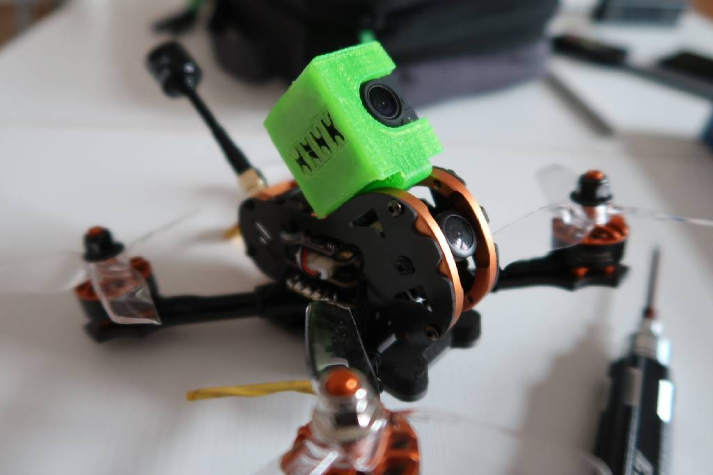
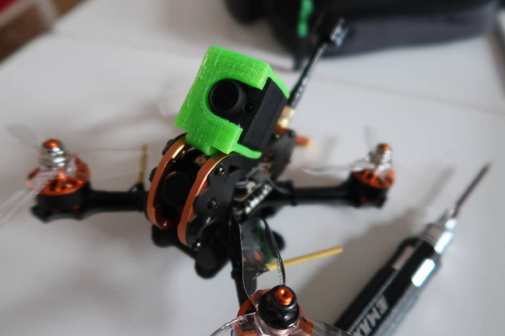
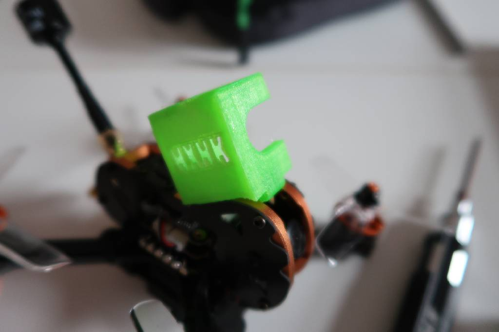
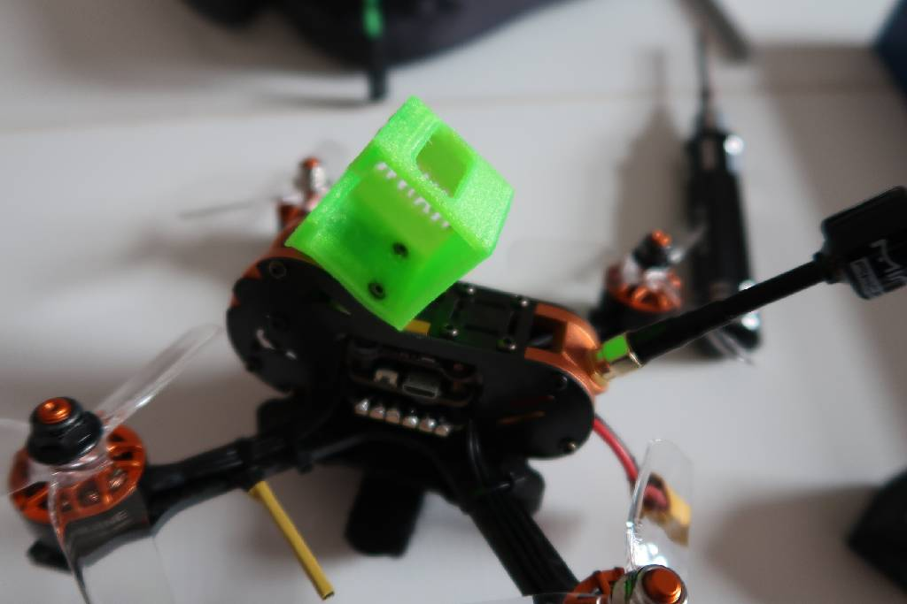

# Tyro79 SQ12 Action Camera Mount

A cheap small drone calls for a cheap small camera. SQ12 action cam mount for Eachine Tyro79

This is a camera mount for the SQ12 action camera on the DIY Eachine Tyro79 frame. The camera tilt is ca. 30°. This model was made using [solvespace](https://solvespace.com/index.pl), a free and fun to use CAD application.

This model is also available as a printable STL file on [Thingiverse](https://www.thingiverse.com/thing:4700483)

